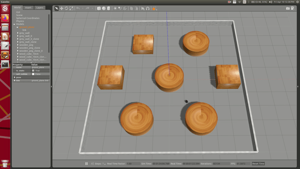

# path-planning-astar-turtlebot
This is the repository for the project - Path planning implemented for the Turtlebot using A* Algorithm. 

## Phase 3

### System and library requirements.
 - Python3
 - Numpy
 - matplotlib
 - math
 
### How to Run
1. Clone this repo or extract the "proj3_5_gazebo.zip" file.  
2. Navigate to the folder "Phase_3"  
3. To view the simulation video for the following parameters - 
Start : (-4, 3, 0)
Goal : (4, -3)
Radius and clearance : Robot radius and 0.2 meters
Open the video "Phase3_video.avi" 
4. To run the code, from the terminal, run the command `python3 main.py`  
5. The program will ask for the clearance (in meters) from the obstacles, provide input in 'float' format. For eg: 0.2 
6. Next program will ask for start point, provide input in [x,y,theta] format. For eg: [-4,3,0]. If the points provided are in the obstacle space or out of bounds, program will ask you to re-enter points. 
7. Next program will ask for goal point, provide input in [x,y] format. For eg: [4,-3].
If the points provided are in the obstacle space or out of bounds, program will ask you to re-enter points. 
8. You will then be asked the two RPM's for the wheels, provide input in [rpm1,rpm2] format, For eg: [6,4]  

The blue circle is the start point, and the yellow circle is the goal with threshold radius of 0.25 meters. The green color is for the explored nodes, while the black color signifies the final path. 

## Phase 4

## System and library requirements.
 - Python3
 - Numpy
 - matplotlib
 - math
 - ROS Kinetic (Ubuntu 16.04)
 - Gazebo 7.0.0
 
## How to Run
1. Clone this repo or extract the "proj3_5_gazebo.zip" file.  
2. Navigate to the folder "Phase_4"  
3. To view the simulation video for the following parameters - 
Start : (-4, -3, 0)
Goal : (0, -3)
Radius and clearance : Robot radius and 0.2 meters
Open the video "Phase4_video1.mp4" 
4. To view the simulation video for the following parameters - 
Start : (-4, -4, 0)
Goal : (4.3, 2.5)
Radius and clearance : Robot radius and 0.2 meters
Open the video "Phase4_video2.mp4" 
5. To run the simulation, firstly navigate to the "turtlebot3_ws" folder.  
6.Enter the command "catkin_make" inside this folder to initialize it as a ROS workspace.
Once you have done this, go back to home and then source this ROS workspace using "source <path to setup.bash>"
7.Once this is done, you can run the turtlebot 3 Gazebo world simulation using the command - "roslaunch turtlebot3_astar turtlebot3_gazebo_astar.launch x_pos:=0.0 y_pos:=-3.0 yaw:=0.0". Here you can set the start point for the robot to spawn. x_pos --> x-coordinate, y_pos --> y-coordinate, yaw --> Initial orientation of robot w.r.t world x-axis. Ensure that the start point you give here is the same start point you give later when asked again.
8. The program will ask for the clearance (in meters) from the obstacles, provide input in 'float' format. For eg: 0.2 
9. Next program will ask for start point, provide input in [x,y,theta] format. For eg: [-4,3,0]. If the points provided are in the obstacle space or out of bounds, program will ask you to re-enter points. 
10. Next program will ask for goal point, provide input in [x,y] format. For eg: [4,-3].
If the points provided are in the obstacle space or out of bounds, program will ask you to re-enter points. 
11. You will then be asked the two RPM's for the wheels, provide input in [rpm1,rpm2] format, For eg: [6,4]  
12. Voila! You should see the Turtlebot 3 follow the planned path to reach the goal and stop.

